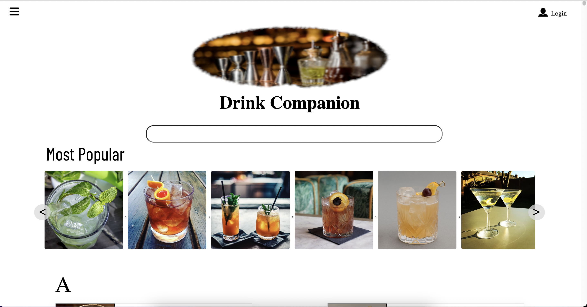

## Robert Hubert

## Latest Projects

  
   http://www.drink-companion.com
  
  
  
 
 A mobile responsive cocktail recipe site with seach capabilities    
 using rapid api, django for user/session managment and ORM,    
 styled using vanilla javascript and plain CSS

<!--
**Rhubert710/Rhubert710** is a ✨ _special_ ✨ repository because its `README.md` (this file) appears on your GitHub profile.

Here are some ideas to get you started:

- 🔭 I’m currently working on ...
- 🌱 I’m currently learning ...
- 👯 I’m looking to collaborate on ...
- 🤔 I’m looking for help with ...
- 💬 Ask me about ...
- 📫 How to reach me: ...
- 😄 Pronouns: ...
- ⚡ Fun fact: ...
-->

